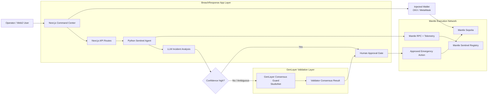
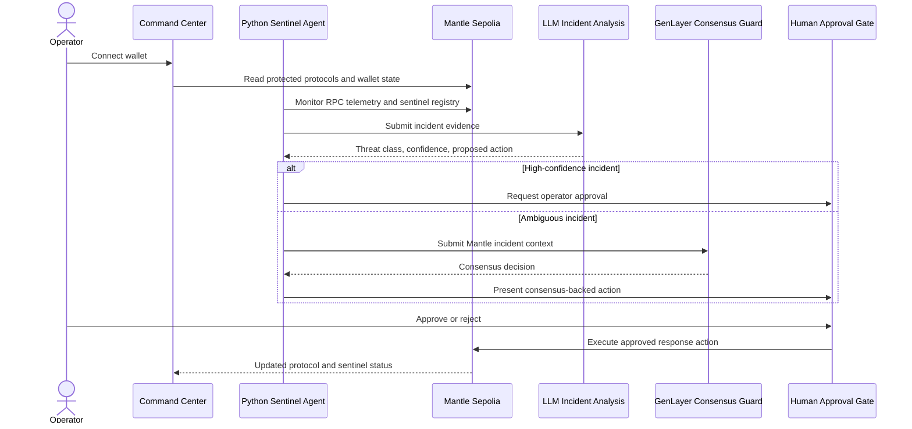

# BreachResponse

AI-assisted incident response for suspicious Mantle contract activity.


Live Command Center: http://43.131.9.176:8900

BreachResponse watches Mantle contract activity, turns suspicious signals into structured incident context, and keeps high-risk response actions behind operator approval. The platform combines a Mantle-aware monitoring agent, Solidity review contracts, and a Command Center UI for controlled review and approval workflows.


## Why it matters

Smart contract teams often see raw activity before they have enough context to act. BreachResponse is built around a cleaner review model:

1. Monitor Mantle activity and sentinel telemetry.
2. Surface suspicious transaction patterns and protocol anomalies.
3. Explain what changed in operator language.
4. Structure the risk context for review.
5. Keep high-risk next steps behind approval.
6. Record the review trail for follow-up.


## Product scope

BreachResponse focuses on Mantle security infrastructure: monitoring protocol activity, classifying suspicious behavior, and preparing scoped emergency response proposals for operator approval. The product intentionally avoids trading automation, liquidity management, and wallet-economy features so the Command Center stays focused on runtime audit assistance for Mantle builders.

See [Product Scope](./docs/PRODUCT_SCOPE.md) for the scope decision, integration boundaries, and future adapter path.

## Core capabilities

- Mantle sentinel registry for protocol onboarding and review permissions.
- Next.js Command Center for suspicious-activity review, approval controls, and live telemetry.
- Python monitoring agent for Mantle RPC scanning, LLM-assisted runtime analysis, and structured event output.
- Solidity validation contracts and tests that prove the vulnerable path and the controlled defense path.
- Safe environment templates with no committed keys or production secrets.
- CI checks covering frontend, contracts, agent syntax, and dependency audits.

## Runtime audit assistance

BreachResponse uses an LLM-assisted analysis layer to convert suspicious Mantle activity into structured runtime review reports. The model explains the likely issue, assigns confidence, summarizes evidence, and passes the result into the approval path when a high-risk next step is involved.

The LLM does not get unchecked execution authority. Human approval is the default response mode, and any automated policy should be limited to allowlisted contracts, capped actions, emergency selectors, and monitored thresholds.

See [AI Incident Analysis](./docs/AI_INCIDENT_ANALYSIS.md) for the model input/output shape and safety model.

## External decision guard

BreachResponse includes an external guard layer for cases where the fast LLM path is unavailable, malformed, low-confidence, conflicting, or recommends a risky action. The user-facing wallet flow stays on Mantle. In this version, the guard layer is powered by a GenLayer intelligent contract. The app talks to GenLayer as a consensus validation layer, then uses the result before a high-risk Mantle-side response reaches approval. Operators, reviewers, and protocol teams can inspect it directly here:

| File | Purpose |
| --- | --- |
| [`contracts/genlayer/IncidentConsensusGuard.py`](./contracts/genlayer/IncidentConsensusGuard.py) | GenLayer intelligent contract that stores incidents, calls validator-side LLM reasoning, enforces the emergency-action allowlist, and records consensus decisions. |
| [`tests/direct/test_incident_consensus_guard.py`](./tests/direct/test_incident_consensus_guard.py) | Direct-mode GenLayer tests for approval, rejection, low-confidence escalation, malformed validator output, unsafe action rejection, duplicate incidents, and execution marking. |
| [`frontend/src/lib/genlayerConsensus.ts`](./frontend/src/lib/genlayerConsensus.ts) | Real `genlayer-js` read/write integration used by the Command Center consensus guard panel. |
| [`frontend/src/app/dashboard/page.tsx`](./frontend/src/app/dashboard/page.tsx) | Operator UI panel for preparing the app-managed GenLayer signer, reading consensus records, and validating incidents once a deployed guard address is configured. |

The contract uses GenLayer nondeterminism and validator consensus through `gl.nondet.exec_prompt(...)` and `gl.vm.run_nondet_unsafe(...)`. It only approves scoped emergency actions such as `pause_protocol`, `quarantine_address`, `monitor_only`, `alert`, and `multisig_proposal`.

Normal users do not switch wallets to GenLayer. Mantle remains the execution network for protected protocols, registry updates, wallet UX, and response transactions. GenLayer runs on StudioNet/testnet and receives incident context through the BreachResponse service/UI layer.

Validate it with:

```bash
genvm-lint check contracts/genlayer/IncidentConsensusGuard.py --json
python -m pytest tests/direct/test_incident_consensus_guard.py -q
```

The StudioNet deployment used by the frontend is:

| Field | Value |
| --- | --- |
| Network | GenLayer StudioNet |
| Consensus guard contract address | `0x86369EC44fbB5EB682729368557176858aBe0c73` |
| Deployment transaction | `0xec4e0f05378f1f9ebd0d3d47fc1b6ee815ff3b0a4cd271988f0c1d5ab3b9970a` |
| Deployer | `0x65567Bf52e47A20C10793748C36597fAC2E3056D` |
| Verification | `genlayer schema` and `genlayer call get_stats` succeeded on StudioNet |

To enable live frontend escalation, set:

```bash
NEXT_PUBLIC_GENLAYER_CONSENSUS_GUARD_ADDRESS=0x86369EC44fbB5EB682729368557176858aBe0c73
NEXT_PUBLIC_GENLAYER_STUDIO_URL=https://studio.genlayer.com/api
```

## Mantle Sepolia deployment

The current SentinelRegistry deployment used by the frontend is:

| Field | Value |
| --- | --- |
| Network | Mantle Sepolia |
| Registry contract address | `0xea3C039795B5b04105B795c8B0cB85e0a42Cc85C` |
| Explorer | https://sepolia.mantlescan.xyz/address/0xea3C039795B5b04105B795c8B0cB85e0a42Cc85C#code |
| Deployment transaction | https://sepolia.mantlescan.xyz/tx/0x0dac721b1ed137bf93132222348aab39bae48ed3a6e8b8e6ed0d0ee9d91f2b07 |
| Deployer | `0x9f758be3ae3d985713964339e2f0bd783fc6015c` |
| Source verification | Verified on Mantlescan and Sourcify |

## Product screens

### Command Center


### Mobile overview


## Product walkthrough

For product review, use the shortest honest walkthrough:

1. Open the landing page and click **Features** to jump to **Pipeline Execution**.
2. Click **Enter Command Center** to open the operator dashboard.
3. Connect a Mantle Sepolia wallet for live wallet state, or leave it disconnected to show the safe disabled state.
4. Review the Sentinel Guard and external decision guard panels.
5. Explain the boundary clearly: normal users keep their wallet on Mantle, while BreachResponse submits ambiguous incident context to GenLayer through the app layer for validator-consensus review.
6. Use **Threat History** for incident review, then return with browser back or **BACK** without getting trapped in the dashboard.

See [Review Workflow](./docs/REVIEW_WORKFLOW.md) for the full walkthrough and exact wording.

## Architecture

Mantle remains the execution network for registry state, monitored assets, wallet actions, and approved response transactions. The external guard validates ambiguous AI/security decisions before high-risk actions reach approval.

### System architecture



### Incident validation flow



See [Architecture](./docs/ARCHITECTURE.md) for the full system design and trust boundary.

## Quick start

### Prerequisites

- Node.js 22+
- Python 3.11+
- npm 10+
- Mantle Sepolia RPC access

### Clone

```bash
git clone https://github.com/mystiquemide/breachresponse.git
cd breachresponse
cp .env.example .env
```

Fill `.env` with your own local or testnet values. Never use production private keys while testing.

### Frontend

```bash
cd frontend
npm ci
npm run lint -- --max-warnings=0
npx tsc --noEmit
npm run build
npm run dev
```

Open http://localhost:3000.

### Contracts

```bash
cd contracts
npm ci
npm run compile
npm test
```

The contract tests cover both sides of the incident model:

- the vulnerable vault path can be drained when unprotected
- the same attack reverts when the sentinel pauses the vault

### Agent

```bash
cd agent
python -m venv .venv
source .venv/bin/activate
pip install -r requirements.txt
python -m compileall -q .
python main.py
```

## Verification commands

Run these before opening a PR:

```bash
cd frontend
npm ci
npm run lint -- --max-warnings=0
npx tsc --noEmit
npm run build
npm audit --audit-level=moderate

cd ../contracts
npm ci
npm run compile
npm test
npm audit --audit-level=moderate

cd ../agent
python -m compileall -q .
```

GenLayer fallback checks:

```bash
genvm-lint check contracts/genlayer/IncidentConsensusGuard.py --json
python -m pytest tests/direct/test_incident_consensus_guard.py -q
```

## Repository layout

```text
agent/                Python monitoring and payload formulation agent
contracts/            Solidity registry, target vault, attacker validation scenario, tests
contracts/genlayer/   GenLayer intelligent contract fallback for consensus incident review
frontend/             Next.js Command Center and API routes
tests/direct/         GenLayer direct-mode tests
docs/                 Architecture, threat model, deployment, runbooks, roadmap
.github/              CI, CodeQL, Dependabot, issue templates, PR template
```

## Production posture

BreachResponse is designed for controlled deployment. Human approval is the default response mode. Autonomous execution should only be enabled for scoped contracts, capped actions, allowlisted payloads, emergency pause functions, and monitored policy thresholds.

See [Threat Model](./docs/THREAT_MODEL.md), [Operator Runbook](./docs/OPERATOR_RUNBOOK.md), and [Deployment](./docs/DEPLOYMENT.md).

## License

MIT. See [LICENSE](./LICENSE).
