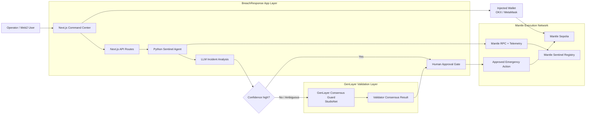
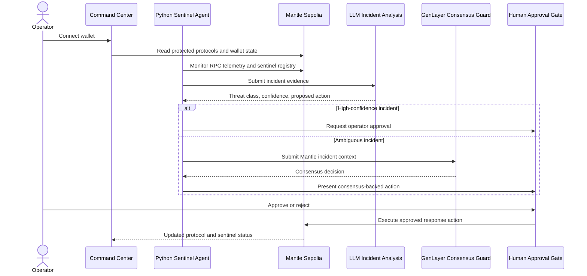
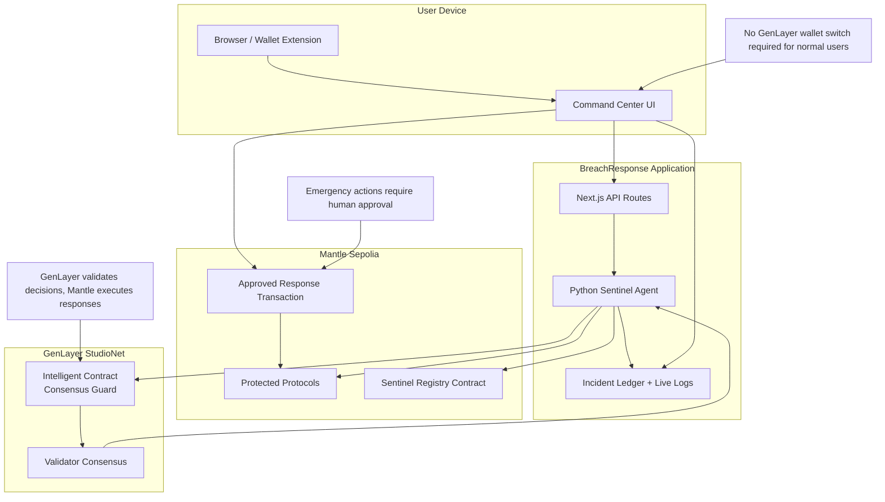

# Architecture

BreachResponse is split into monitoring, analysis, operator control, GenLayer consensus validation, and Mantle execution. The architecture is documented as Mermaid code so it renders in GitHub, stays diffable in pull requests, and reads like engineering documentation instead of a decorative image.

## System architecture



## Incident validation flow



## Trust boundary



## System layers

### 1. Monitoring agent

The Python agent connects to Mantle RPC, scans activity, and forwards structured alerts. It is responsible for:

- polling or streaming transaction data
- tracking protocol sentinel state
- detecting known exploit patterns
- forwarding alerts to the Command Center
- preparing candidate response actions

### 2. LLM-assisted analysis and payload formulation

The analysis layer converts raw telemetry into operator decisions. Suspicious activity is submitted to the configured LLM as structured incident context, then normalized into a response proposal. The model is advisory by default and cannot bypass operator approval or policy controls.

A response proposal includes:

- threat class
- affected protocol
- supporting evidence
- expected blast radius
- proposed action
- target contract
- calldata or high-level wallet action
- confidence and risk notes

See [AI Incident Analysis](./AI_INCIDENT_ANALYSIS.md) for the model schema and safety rules.

### 3. Command Center

The Next.js Command Center gives operators a live view of:

- connected wallet and network state
- registered sentinels
- incident timeline
- response status
- simulated attack and mitigation path

Human approval is the default control path.

### 4. GenLayer consensus guard

Low-confidence or disputed incident proposals can be sent to the GenLayer intelligent contract before an emergency response is proposed on Mantle. This path is application-mediated: BreachResponse submits Mantle incident context to GenLayer, GenLayer validators produce a consensus decision, and the Command Center uses that decision as a gate before any Mantle action.

Normal users and operators keep their wallet on Mantle. The GenLayer StudioNet/testnet signer is app-managed for the consensus guard path and should be treated as backend or admin infrastructure, not as a second user wallet requirement.

### 5. On-chain response

The contracts layer provides a Mantle registry and validation contracts. The registry tracks protected protocols and the authorized sentinel agent. The target vault and attacker contracts prove the threat model in tests.

## Response modes

| Mode | Purpose | Execution |
| --- | --- | --- |
| Manual approval | Default operator safety | Human signs response transaction |
| Policy approval | Production automation with limits | Allowlisted actions pass predefined rules |
| Emergency pause | Fast containment | Scoped pause or quarantine action only |

## Data flow

```text
Mantle RPC
  -> Python sentinel
  -> LLM-assisted classifier and response proposal
  -> GenLayer consensus guard for low-confidence or risky cases
  -> safety checks
  -> Command Center incident card
  -> wallet, multisig, or policy engine approval
  -> Mantle response transaction
  -> audit log and post-incident review
```

## Design decisions

1. Python handles monitoring because Web3.py and data tooling are mature for agent workflows.
2. Next.js, Wagmi, and Viem handle wallet UX and Mantle network state.
3. Solidity contracts keep the registry and validation layer explicit and testable.
4. Human approval is default because autonomous response can become dangerous without scoped policy controls.
5. The vulnerable test vault exists only to prove the exploit and mitigation path.
6. LLM output is advisory until validated by deterministic safety rules and operator approval.
7. GenLayer is a consensus validation layer, not the user execution network. Mantle remains the chain for registry state and response transactions.
8. Mermaid diagrams are preferred for repository architecture because they are reviewable as code and render natively on GitHub.
